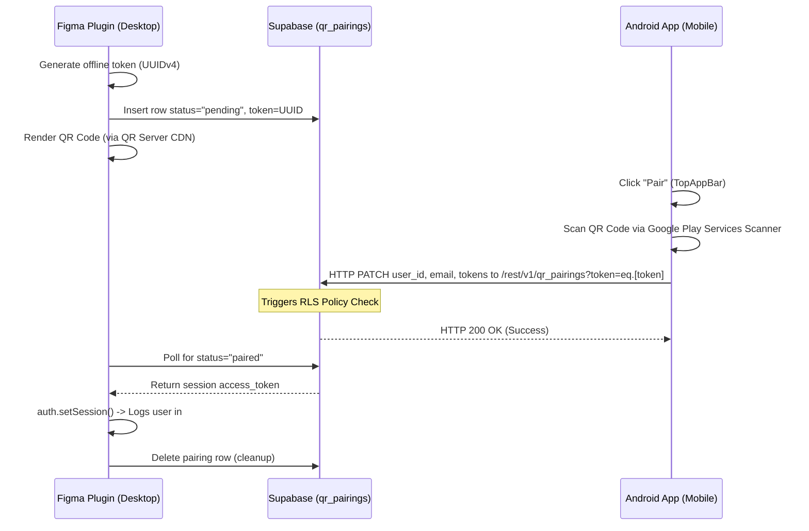

# Android App — QR Code Pairing & Scanner Integration Guide

This document describes the technical architecture, dependencies, code changes, and verification protocols implemented for the companion Android app to support instant QR Code Login pairing with the Figma Plugin and Web App.

---

## 🏗️ Architectural Overview

The pairing flow allows a researcher to log in on their mobile device and instantly pair their active authentication session with a desktop browser or Figma plugin window via a short-lived QR pairing token.



---

## 📦 1. Dependencies Setup

We avoided requesting generic Android camera permissions by integrating **Google Play Services Code Scanner**. This opens a secure Google bottom sheet scanner over the app, avoiding the need for boilerplate permission requests or custom camera preview controllers.

### Version Catalog (`android-app/gradle/libs.versions.toml`)
```toml
[versions]
# Play Services Code Scanner version definition
playServicesCodeScanner = "16.1.0"

[libraries]
# Scanner library definition
play-services-code-scanner = { module = "com.google.android.gms:play-services-code-scanner", version.ref = "playServicesCodeScanner" }
```

### Module Gradle Build Configuration (`android-app/app/build.gradle.kts`)
```kotlin
dependencies {
    // Import Play Services Code Scanner
    implementation(libs.play.services.code.scanner)
    
    // OkHttp client is used for secure REST API updates
    implementation(libs.okhttp)
}
```

---

## 📂 2. Kotlin Component Implementations

### Session Storage (`SharedPreferencesHelper.kt`)
To persist the user session for instant pairing, we expanded the settings preferences helper to save both the `access_token` and `refresh_token` returned by Supabase Auth:

```kotlin
fun saveAuth(token: String, refreshToken: String, userUuid: String, email: String) {
    prefs.edit()
        .putString("auth_token", token)
        .putString("refresh_token", refreshToken)
        .putString("user_uuid", userUuid)
        .putString("user_email", email)
        .apply()
}

fun getRefreshToken(): String? = prefs.getString("refresh_token", "")
```

### Top Bar & Scan Trigger (`MainScreen.kt`)
The **Pair** button is integrated inside the app's primary `TopAppBar` dashboard. When clicked, it initializes the Google scanner client:

```kotlin
// Initialize scanner options to scan only QR Codes
val options = GmsBarcodeScannerOptions.Builder()
    .setBarcodeFormats(Barcode.FORMAT_QR_CODE)
    .enableAutoZoom()
    .build()

val scanner = GmsBarcodeScanning.getClient(context, options)

// Trigger code scanner sheet
scanner.startScan()
    .addOnSuccessListener { barcode ->
        val scannedToken = barcode.rawValue
        if (scannedToken != null) {
            executePairing(scannedToken, context, prefs, coroutineScope)
        }
    }
    .addOnFailureListener { e ->
        Toast.makeText(context, "Scanning failed: ${e.message}", Toast.LENGTH_SHORT).show()
    }
```

### Server Side Pairing Request (`MainScreen.kt`)
Once the token is scanned, the mobile app executes an HTTP `PATCH` query to write the active authentication variables to the Supabase database. The request must include the user's secure Bearer token:

```kotlin
val client = OkHttpClient()
val mediaType = "application/json".toMediaType()
val payload = JSONObject().apply {
    put("status", "paired")
    put("user_id", userUuid)
    put("email", email)
    put("access_token", token)
    put("refresh_token", refreshToken)
}

val req = Request.Builder()
    .url("https://naneeovpzwyfnbaaujpi.supabase.co/rest/v1/qr_pairings?token=eq.${scannedToken}")
    .patch(payload.toString().toRequestBody(mediaType))
    .addHeader("apikey", anonKey)
    .addHeader("Authorization", "Bearer ${token}") // Authenticated user token
    .build()
```

---

## 🔐 3. Database Security (Row Level Security)

To allow the anonymous client (Figma plugin) to start the request, and the authenticated app to complete it, the following RLS policies must be enabled on the `qr_pairings` table:

```sql
-- Allow anyone to request a pairing token initially
CREATE POLICY "Allow public to insert pairing request" ON public.qr_pairings
    FOR INSERT TO public WITH CHECK (
        status = 'pending' AND user_id IS NULL AND access_token IS NULL AND refresh_token IS NULL
    );

-- Allow authenticated companion apps to update pending tokens
CREATE POLICY "Allow authenticated users to pair session" ON public.qr_pairings
    FOR UPDATE TO authenticated 
    USING ( status = 'pending' )
    WITH CHECK ( status = 'paired' );
```

---

## 🛠️ Troubleshooting & Verification

> [!IMPORTANT]
> **RLS Policy Violations (HTTP 401/403)**  
> If the mobile app displays a `Pairing failed: 403` or similar error, verify that the `with check ( status = 'paired' )` clause has been run in your Supabase SQL console. Without this clause, PostgreSQL enforces the `USING` clause (`status = 'pending'`) on the new row post-update, which rejects updates that modify status to `'paired'`.

> [!NOTE]
> **Google Play Services Download**  
> First-time installation on some simulators or devices without Google Play Services enabled might delay the scanner sheet launch while Google downloads the scanner module dependencies in the background. Ensure the test device is signed into a Google Account.
