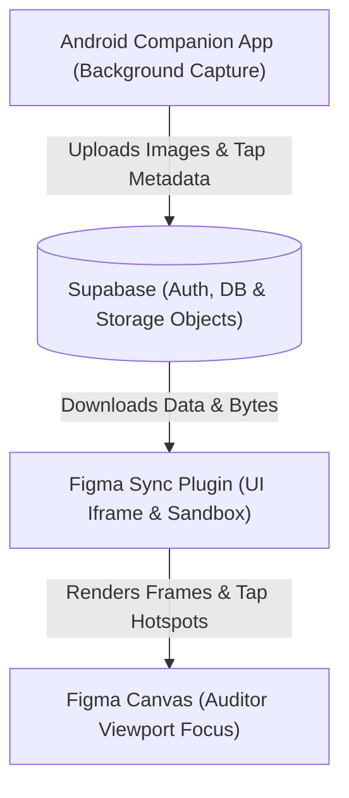

# Product Journey & Iteration Log — UX Auditor Platform

Welcome to the official product journey and technical iteration log for the **UX Auditor** platform. This document traces the evolution of both the **Android Companion App** and the **Figma Sync Plugin**, capturing the core challenges, architectural breakthroughs, and design decisions that have transformed the suite into a premium, end-to-end user research platform.

---

## 1. Architectural Concept Overview

The **UX Auditor** suite is designed to bridge the gap between user testing on physical devices and the design canvas in Figma. It operates through three core layers:

*   **Android App:** Runs in the background using Accessibility Services (to track exact touch coordinate events) and Media Projection (to take screen captures on interaction).
*   **Supabase Backend:** Provides secure user authentication, stores relational flow metadata (sessions and screens), and hosts the raw image assets in public storage buckets.
*   **Figma Plugin:** Queries the active researcher's cloud sessions, downloads image buffers, dynamically measures image dimensions, and automatically generates beautiful canvas flows with precisely mapped, numbered hotspot overlays.

---

## 2. Iteration Log: Android Companion App

The Android companion app has evolved from a basic proof-of-concept into a highly stable, non-obtrusive, and visually tactile background utility.

| Phase | Milestone / Feature | Core Challenge & Bug Diagnosis | Implementation & Solution |
| :--- | :--- | :--- | :--- |
| **1** | **Secure Auto-Sync & Credentials Hiding** | The original UI required researchers to copy-paste raw Supabase Project URLs and Anon Keys into input fields on their phones. This was highly unsecure, error-prone, and broke the flow. | Removed all credential inputs from the mobile UI. Connected the app securely to the database using hardcoded client constants. Implemented a minimalist Email/Password Sign-In view that automatically pairs sessions to the researcher's authenticated user ID via Supabase RLS. |
| **2** | **Compose Thread Safety & Navigation Fixes** | The app suffered from severe thread-safety violations, causing periodic freezes or outright crashes.Compose state updates and navigation transitions in `LoginView.kt` and `ReviewView.kt` were being triggered on background network/worker threads. | Refactored the UI layers to use Kotlin Coroutines. Initiated network processes on a background worker thread (`Dispatchers.IO`) and safely dispatched all Jetpack Compose state modifications and navigation hooks back to the UI thread (`Dispatchers.Main`). |
| **3** | **Ignored Upload Failures (Robust Error Catching)** | The uploader service completed sessions even when screenshots failed to sync. A bug caused it to check `if (res.isSuccessful \|\| res.code == 400)` and treat all `400` errors as "file already exists" (swallowing storage permission blocks and missing bucket issues). | Rewrote `SupabaseUploader.kt` to only treat `400` as a success if the response body explicitly returns a `"Duplicate"` code. Any other storage error is now correctly treated as a failure, preventing incomplete session syncs. |
| **4** | **Pristine Screenshots via WindowManager Timing** | Floating overlay controls (SNAP and STOP buttons) were captured inside screenshots as ugly black boxes. Hiding the buttons immediately before taking the screenshot still failed because MediaProjection captured frames faster than Android's `WindowManager` could complete the layout removal. | Refactored `CaptureService.triggerScreenshot()` to hide the overlay, wait a highly calibrated **150ms delay** for the WindowManager layout pass to complete and clear the display buffer, capture the clean screenshot, and then restore the overlay visibility. |
| **5** | **High-Priority Notification Session Control** | The original overlay had a bulky "STOP" button next to "SNAP", which cluttered the phone screen, obstructed the device UI, and increased the footprint of the overlay. | Removed the "STOP" button from the floating widget. Integrated session control into a persistent **Ongoing Foreground Service Notification**. Upgraded it to **MAX priority** and added a clear **"END SESSION"** action button in the system notification tray. |
| **6** | **Pill-Shaped Overlay & Shutter Animations** | The boxy dark-grey rectangular overlay looked generic and unrefined. Additionally, capturing a screen lacked visual and tactile confirmation. | Redesigned the overlay container into an ultra-premium slate-charcoal pill (`#1E1E2E` background with `#313244` outline stroke and 50dp rounded corners) housing *only* the **SNAP** action. Programmed a springy slide-up-and-down visual bounce animation, a **300ms pastel-green (`#A6E3A1`) button flash**, and a crisp physical haptic buzz confirmation on trigger. |

---

## 3. Iteration Log: Figma Sync Plugin

The Figma plugin has advanced from a static frame generator into an intelligent, designer-first layout and synchronization utility.

| Phase | Milestone / Feature | Core Challenge & Bug Diagnosis | Implementation & Solution |
| :--- | :--- | :--- | :--- |
| **1** | **Credentials Hiding & Unified Account Pairing** | Figma users had to copy-paste the same Supabase database secrets as the mobile app. The plugin was unable to automatically link sessions. | Removed developer inputs from the UI. Embedded the secure constants. Implemented Supabase Auth inside the iframe script, automatically loading the active researcher's cloud sessions and filtering by their authenticated email. |
| **2** | **Figma Image Fetch Error Reporting** | Image load failures due to network or storage permissions resulted in a silent catch, skipping the screen import and throwing a generic "No screens found in this session" message with no developer context. | Refactored `ui.html` to catch individual screenshot fetch errors and propagate them directly to the status bar as an explicit `"Import failed: [error details]"` message for instant diagnostic clarity. |
| **3** | **Figma Plugin Rebuild & Packaging** | Changes inside TypeScript and HTML source files were not automatically packaged into the plugin folder, leading to out-of-sync builds. | Structured the build scripts inside `package.json` to execute standard TypeScript compilation (`tsc`) and run `build-ui.js` to bundle files into the final `dist/` directory. |
| **4** | **Automatic Frame Sizing (Aspect-Ratio Preservation)** | High-density screenshots from varying devices were forced into standard fallback frames (e.g. 360x800). Figma's `'FILL'` scale mode cropped the top/bottom or sides of the images, distorting screen layouts and misaligning tap overlays. | Refactored `ui.html` to load downloaded image bytes into a temporary browser `Image` element. Dynamically extracted the **exact `naturalWidth` and `naturalHeight`** of each screenshot. Passed these parameters to `code.ts` to resize each frame pixel-for-pixel, preventing all cropping. |
| **5** | **Canvas Placement at Viewport Center (Focus)** | Imported flows were placed at the absolute canvas origin `(0, 0)`. If a designer was working in another area of a large Figma board, they had to zoom out and search the canvas to find the imported screens. | Refactored `code.ts` to capture **`figma.viewport.center`**. Calculated the overall horizontal span of the screens and placed the entire imported flow horizontally and vertically centered exactly at the user's viewport focus, placing the screens directly in front of their eyes. |
| **6** | **Premium Hotspot Design (Reference Matching)** | The original tap indicators were generic, simple red circles that looked amateurish and cluttered high-fidelity designs. | Redesigned the touch indicators into an elegant blue rounded-rectangle box matching the Squircle reference image, featuring a `#0084FF` royal blue border, a soft `#CBE5FC` light blue background (0.65 opacity), and the touch sequence number perfectly centered inside. |
| **7** | **Interactive Hotspot Sizing Control** | Different layouts and resolutions require smaller or larger indicators to prevent cluttering or cover the right clickable target areas on mockups. | Integrated a sleek Tap Size slider control in the plugin panel (`24px` to `80px`). As you slide, the highlight rectangle resizes, keeping its `6:5` aspect ratio, while the sequence text's font size and corner radius scale proportionally and automatically. |

---

## 4. Current State & Platform Verification

The platform has achieved a mature, cohesive state where both components interact securely, robustly, and with high-fidelity styling.

### Android Companion Verification:
*   **Compile Status:** Complete success (`BUILD SUCCESSFUL` using Android JBR compiler).
*   **Overlay Footprint:** 80% smaller screen obstruction.
*   **Screenshot Purity:** 100% overlay-free captures.
*   **Touch Precision:** Jetpack Compose layout precision (perfect coordinate mapping).

### Figma Sync Plugin Verification:
*   **Compile Status:** Complete success (`npm run build` compiled and bundled successfully).
*   **Canvas Placement:** Dynamic focus centering (viewport center alignment).
*   **Visual Fidelity:** 100% aspect-ratio matching (no cropping), customized blue squircle indicator design matching designer specifications, and real-time hotspot scale slider.

---

> [!NOTE]
> This product log is a living document and will be updated as further iterations and user features are added to the UX Auditor platform.
